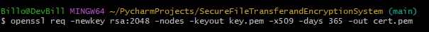

# Easy Encryption System
The Easy Encryption System is a Python-based application that provides a secure, encrypted platform for file sharing and storage. Leveraging advanced cryptographic methods and a robust user authentication system, this application ensures data integrity, confidentiality, and access control.

## Table of Contents
- [Prerequisites](#prerequisites)
- [Installation](#installation)
- [Usage](#usage)
- [Contributing](#contributing)

1. I have imported both my SSL certificates and my MongoDB query connection because I did not wish to upload an incomplete project. It should go without saying, but before attempting to run the program, **YOU NEED to replace them with your own SSL certificates and MongoDB database**. It's not secure to use SSL certificates and databases that have been made publicly available (even if you're only testing on your local machine).
2. **DO NOT TRUST THE SSL CERTIFICATES AND MONGODB CONNECTION I HAVE ALREADY CREATED. SWAP THEM FOR YOURS**.


## Prerequisites
Don't worry if some links are broken. Most of the prerequisites are easy to find with a simple name search on Google!
1. Python 3.10+.
2. A working version of [PIP](https://pypi.org/project/pip/).
3. [PyCharm](https://www.jetbrains.com/pycharm/download/?section=windows)(not required, but very much recommended—it makes adding libraries to the Python project extremely easy).
   - Some familiarity with IDEs is expected.
5. Git Bash terminal(used to create the SSL certificates).
6. [MongoDB](https://www.mongodb.com/products/platform/atlas-database)(You will need to create a database and three collections. I recommend using my naming for each respective collection (which are already hardcoded in the code) so you don’t have to change them yourself).
   - It’s recommended that you look up a tutorial on how to set up MongoDB and connect it with your application/website backend if you are not familiar with the process.

## Installation

1. Clone the repository:
   ```bash
   git clone https://github.com/KalifasXD/easy-encryption.git
2. Navigate into the project folder:
   ```bash
   cd easy-encryption
3. Create a virtual environment (optional but recommended):
   ```bash
   python -m venv venv
4. Install the dependencies:
   ```bash
   pip install -r requirements.txt
   ```
   - If you’re using PyCharm, it will notify you that you can use this file to install the required dependencies once you’ve opened the project!
5. Generate the SSL Certificates:
   1. **Boot up Git Bash** and type in the following command:
      - By default, Git Bash includes the ability to create SSL certificates. Run the following command to generate them:
        
        ```bash
        openssl req -newkey rsa:2048 -nodes -keyout key.pem -x509 -days 365 -out cert.pem
        ```
        
   3. Let's break down what everything means:
      - **openssl req**: This command tells OpenSSL to create a new certificate request
      - **-newkey rsa:2048**: This creates a new RSA private key with a length of 2048 bits.
      - **-nodes**: This option means "No DES," which ensures that the private key will not be encrypted with a passphrase (making it easier for servers to use).
      - **-keyout key.pem**: This specifies the file where the private key will be saved (**key.pem**).
      - **-x509**:  This tells OpenSSL to create a self-signed certificate (instead of generating a certificate signing request (CSR)).
           - This is important because we are testing locally. For production environments, you'd need to get a certificate from a trusted Certificate Authority (CA).
      - **-days 365**: This sets the certificate validity period to 365 days (you can adjust this number as needed).
      - **-out cert.pem**: This specifies the output file for the certificate (**cert.pem**).
      - The command will output two files:
           - **key.pem**: This is the private key file.
           - **cert.pem**: This is the self-signed SSL certificate.
           - Replace these two files with the ones I have created
   4. After executing the command, you will be prompted to fill out some information for the certificate. Fill in your information accordingly.
      - I have attached the video I found the most helpful to [create](https://www.youtube.com/watch?v=Dci5-OaIGNQ) an SSL certificate.
      - One remark about it: I had to input **localhost** as the **common name** in order to get it working.
   5. Final steps:
      - After completing the prompts, you should have the two **.pem** files.
      - **Place them in your project directory** so that the code can find and use them when it’s executed.


## Usage

1. First and foremost, you will need to launch the server script(Server_Launch.py).
   ```bash
   Open PowerShell or terminal
   
2. Navigate to the project folder (where the clone was downloaded).

3. While inside the project folder, navigate to.
   ```bash
   cd ../venv/scripts
4. Now, call ./activate to enable the Flask server.
   ```bash
   ./activate
5. Now navigate back to the folder you accessed in step 2.
   ```bash
   cd ../..
   ```
   - *The above command should get to the same position as you were in the second step.*

7. Run the following command to start the Flask server
   ```bash
   python main.py
   
8. If you have completed every step successfully, it should look like this:


That’s it! You should now get a message saying the Flask server is up and running.
This script is responsible for holding all of the server logic. It is what "listens" for requests and acts accordingly. If you make any changes to the script, remember to re-run it before testing your changes.
