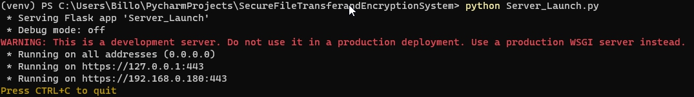

# Easy Encryption System
The Easy Encryption System is a Python-based application that provides a secure, encrypted platform for file sharing and storage. Leveraging advanced cryptographic methods and a robust user authentication system, this application ensures data integrity, confidentiality, and access control.

## Table of Contents
- [Prerequisites](#prerequisites)
- [Installation](#installation)
- [Usage](#usage)
- [Contributing](#contributing)

1. I have imported both my SSL certificates and my MongoDB query connection because I did not wish to upload an incomplete project. It should go without saying, but before attempting to run the program, **YOU NEED to replace them with your own SSL certificates and MongoDB database**. It's not secure to use SSL certificates and databases that have been made publicly available (even if you're only testing on your local machine).
2. **DO NOT TRUST THE SSL CERTIFICATES AND MONGODB CONNECTION I HAVE ALREADY CREATED. SWAP THEM FOR YOURS**.


## Prerequisites
Don't worry if some links are broken. Most of the prerequisites are easy to find with a simple name search on Google!
1. Python 3.10+.
2. A working version of [PIP](https://pypi.org/project/pip/).
3. [PyCharm](https://www.jetbrains.com/pycharm/download/?section=windows)(not required, but very much recommended—it makes adding libraries to the Python project extremely easy).
   - Some familiarity with IDEs is expected.
5. Git Bash terminal(used to create the SSL certificates).
6. [MongoDB](https://www.mongodb.com/products/platform/atlas-database)(You will need to create a database and three collections. I recommend using my naming for each respective collection (which are already hardcoded in the code) so you don’t have to change them yourself).
   - It’s recommended that you look up a tutorial on how to set up MongoDB and connect it with your application/website backend if you are not familiar with the process.

## Installation

1. Clone the repository:
   ```bash
   git clone https://github.com/KalifasXD/easy-encryption.git
2. Navigate into the project folder:
   ```bash
   cd easy-encryption
3. Create a virtual environment:
   ```bash
   python -m venv venv
4. Install the dependencies:
   ```bash
   pip install -r requirements.txt
   ```
   - If you’re using PyCharm, it will notify you that you can use this file to install the required dependencies once you’ve opened the project!
- Ensure that the current directory in Git Bash is your project directory before proceeding. Otherwise, you'll need to manually move all the generated files into your project folder.
5. Generate the SSL Certificates:
   1. **Boot up Git Bash**:
      - By default, Git Bash includes the ability to create SSL certificates.
      - Run the following command to generate them:
        **1. Generate a Private Key:**
        ```bash
        openssl genrsa -out private.key 2048
        ```
        **2. Create a Certificate Signing Request (CSR):**
        ```bash
        openssl req -new -key private.key -out cert.csr -config openssl.cnf
        ```
        **3. Generate the Self-Signed Certificate:**
        ```bash
        openssl x509 -req -days 365 -in cert.csr -signkey private.key -out cert.pem -extensions v3_req -extfile openssl.cnf
        ```
        **4. Combine Private Key and Certificate Into key.pem:**
        ```bash
        cat private.key cert.pem > key.pem
        ```
     2. **As a last step, we need to add the cert.pem into the MMC(Microsoft Management Console):**
           1. Press **Win + R**, type **mmc**, and press Enter.
           2. Add the Certificates Snap-in:
              1. Go to File → **Add/Remove Snap-in**.
              2. Select Certificates, click Add.
              3. Choose Computer Account → Next → Finish.
           3. Navigate to **Trusted Root Certification Authorities**:
              1. Expand the tree under **Certificates**.
           4. Import the *cert.pem* File:
                 1. Right-click Certificates → All Tasks → Import.
                 2. Select your *cert.pem* file
                    - If the *cert.pem* file is not visible, set the file type to **All Files**.
                 3. Follow the prompts to add it.
           5. Save & Close.

## Usage

1. First and foremost, you will need to launch the server script(Server_Launch.py).
   ```bash
   Open PowerShell or terminal
   
2. Navigate to the project folder (where the clone was downloaded).

3. While inside the project folder, navigate to.
   ```bash
   cd ../venv/scripts
4. Now, call ./activate to enable the Flask server.
   ```bash
   ./activate
5. Now navigate back to the folder you accessed in step 2.
   ```bash
   cd ../..
   ```
   - *The above command should get to the same position as you were in the second step.*

7. Run the following command to start the Flask server
   ```bash
   python main.py
   
8. If you have completed every step successfully, it should look like this:


That’s it! You should now get a message saying the Flask server is up and running.
This script is responsible for holding all of the server logic. It is what "listens" for requests and acts accordingly. If you make any changes to the script, remember to re-run it before testing your changes.
